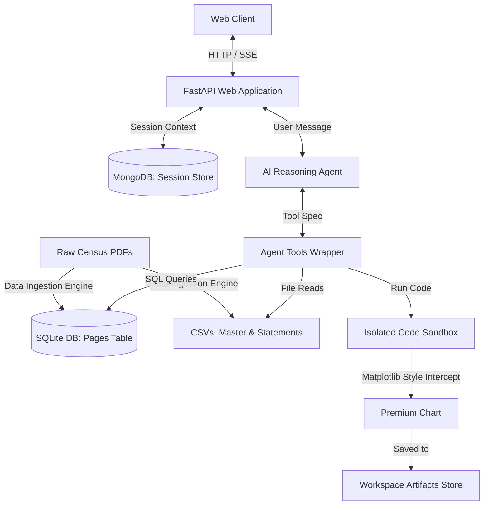

# Census Document Q&A Chatbot: Backend & AI Engine

This repository contains the backend and agentic AI engine for the Census Document Q&A Chatbot. The system is designed to perform document retrieval, semantic Q&A, and advanced data analysis (generating custom Markdown tables and premium Matplotlib charts) on the 2011 Census PCA Highlights for Karnataka, Madhya Pradesh, and Odisha.

---

## 1. System Architecture

The backend is constructed as a modular pipeline separating document ingestion, database indexing, LLM reasoning, code execution sandboxing, and API streaming.



### Core Backend Components
*   **Data Ingestion Engine:** Offline ETL compiler segmenting PDF reports, indexing page texts, and structuring tabular statements.
*   **SQLite Document Search Database:** Database layer compiled with multiple-keyword match query builders and citation snippet generators.
*   **Agentic Conversational Core:** The conversational engine driving the ReAct loop, self-correction logic, JSON boundaries, and token-by-token streaming.
*   **Isolated Code Execution Sandbox:** Subprocess-isolated code execution runner injected with a premium chart styling interceptor.
*   **MongoDB Session Persistence Connection:** Session persistence layer managing split history contexts and sidebar sessions history.
*   **FastAPI Web App Controller:** REST and Server-Sent Events (SSE) API controller.

---

## 2. AI Reasoning Engine

The agent is powered by **GPT-OSS-120B** configured with reasoning parameters. It utilizes an iterative ReAct pattern to reason, call tools, read results, self-correct, and format answers.

### 2.1 ReAct Iteration Loop
1.  **Reasoning Stage:** The agent reviews the user prompt and history, then decides if it needs data. If yes, it specifies a tool call (e.g. searching pages or running python code).
2.  **Execution Stage:** The backend executes the tool and appends the result to the LLM's messages list.
3.  **Analysis Stage:** The agent evaluates the results. If more information or mathematical execution is needed, it triggers another iteration (up to a limit of 10).
4.  **Final Response Stage:** When reasoning is complete, the agent yields its final answers.

### 2.2 LLM Tool Specifications
The agent has access to 5 operational tools:
*   `search_pages`: Looks up pages in the database matching all user keywords.
*   `read_page`: Retrieves the raw markdown text of a target document page.
*   `list_available_csvs`: Exposes schemas and metadata of available flat sheets in the workspace.
*   `execute_python`: Subprocess runner executing calculations or visual plotting scripts.
*   `save_artifact`: Persists tables or analysis documents.

### 2.3 Self-Correction Loop
If the agent writes code that fails (syntax errors, index errors, missing files), the execution sandbox catches the exception and returns the complete python traceback stderr to the LLM. 
The LLM reads the stderr, diagnoses the bug, refines its Python script, and executes it again in the next iteration. This ensures the chatbot remains resilient during complex calculations.

### 2.4 Output Schema Enforcement
The final response is strictly parsed at the LLM boundary to guarantee it complies with a unified JSON schema:
```json
{
  "answer": "Clean Markdown text explanation (raw paths/extensions are hidden from the user)",
  "citations": [
    {
      "source_document": "Source PDF document name",
      "page_number": 52,
      "snippet": "Matching citation context snippet"
    }
  ],
  "artifacts": [
    {
      "name": "comparison_chart",
      "type": "image",
      "description": "Short description of generated chart"
    }
  ]
}
```

### 2.5 Server-Sent Events (SSE) Streaming
To provide a smooth UI experience, the streaming endpoint implements dual-stage Server-Sent Events:
1.  **Thinking/Tool Phase:** While the agent is running tool calls, the API yields events containing the name of the tool and arguments.
2.  **Streaming Answer Phase:** Once the final response JSON is returned and validated, the engine extracts the answer text and streams it chunk-by-chunk.
3.  **Done Phase:** At the end, it emits a termination event containing the parsed citations, logs, and artifacts metadata list.

---

## 3. Data Ingestion & Retrieval Database

### 3.1 PDF Extraction & Document Segmenting
During data preparation:
1.  Raw Census PDF documents are read page-by-page.
2.  Text content is extracted and split.
3.  Cleaned page strings are loaded into a database under the pages table:
    ```sql
    CREATE TABLE pages (
        id INTEGER PRIMARY KEY AUTOINCREMENT,
        state TEXT,
        file_name TEXT,
        page_number INTEGER,
        content TEXT
    );
    ```
4.  Tabular sections (Statements) are extracted from the text, formatted, and written to individual state directories as structured sheets.

### 3.2 Master Dataset Compilation
To support comparisons across states and districts, the data preparation pipeline compiles a unified flat table containing primary demographic columns:
*   State, District Code, District Name
*   Total Population, Male Population, Female Population
*   Sex Ratio
*   Literate Population, Literacy Rate, Male Literacy Rate, Female Literacy Rate
*   Worker Population, Non-Worker Population

### 3.3 Search Query Tokenizer
The search utility splits user search input into distinct clean alphanumeric tokens. It builds a query dynamically using keyword matching joined with logical `AND` statements. This guarantees results only include pages containing *all* specified search keywords, minimizing semantic noise.

---

## 4. Subprocess Execution Sandbox

Python code generated by the agent is executed in an isolated environment to prevent server instability and memory corruption.

### 4.1 Process Isolation
- Runs scripts using an isolated subprocess invocation.
- Executed inside the workspace directory context to prevent accessing system-level paths.
- Thread execution is governed by a timeout limit (default: 15s) to prevent infinite loops.
- Standard output and standard error are completely captured and returned to the agent.

### 4.2 Matplotlib Styling Interceptor
Every script sent to the python execution tool is pre-pended with a global configuration block. This enforces a consistent, professional design system for all generated charts:

> [!NOTE]
> The styling engine operates by overriding the default plotting library backend to a non-interactive headless renderer and intercepting save file calls.

Key styles injected:
*   **Harmonious Color Palette:** Custom color cycle featuring sleek, curated colors: Teal, Amber, Rose, Mint Green, and Indigo.
*   **Premium Backgrounds & Layouts:** Solid card white background coloring, clean dark-slate fonts, dashed light gridlines, and automatic spine-removal (top and right edges are hidden).
*   **High-Res Intercept:** Automatically executes layout compression to prevent label clipping and exports crisp, high-resolution cards with tight padding.

---

## 5. Connection & Context Persistence Layer

Session states, chat histories, and sidebar lists are persisted in MongoDB.

### 5.1 Document Model Schema
Each session document maps as follows:
```javascript
{
    "_id": "<uuid session_id>",
    "title": "First 60 chars of first question",
    "created_at": ISODate("..."),
    "updated_at": ISODate("..."),
    "history": [
        // Compact role/content messages used for LLM context window loading
        {"role": "user", "content": "How many districts in Karnataka?"},
        {"role": "assistant", "content": "There are 30 districts..."}
    ],
    "messages": [
        // Structured messages containing metadata, citations, and artifacts schemas for UI rendering
        {
            "role": "user",
            "question": "...",
            "timestamp": "..."
        },
        {
            "role": "assistant",
            "answer": "...",
            "citations": [...],
            "artifacts": [...],
            "timestamp": "..."
        }
    ]
}
```

### 5.2 Context Window Optimizations
To avoid hitting model context token limits:
1.  **Split Arrays:** We separate the raw history (sent to the reasoning agent) from the rich messages list (sent to the client).
2.  **Context Sanitization:** If the assistant's previous message contains a large raw structured JSON block, the history builder strips the outer wrappers and extracts *only* the plain text answer field before sending it as context to the next iteration. Tool parameters, citations, and logs are kept in the database and omitted from subsequent prompts.

---

## 6. Setup & Configuration

### 6.1 Requirements
*   Python 3.11+
*   MongoDB Instance
*   Cerebras API Key

### 6.2 Local Ingestion & Startup
1.  Clone the repository and activate your python virtual environment.
2.  Install project dependencies:
    ```bash
    pip install -r requirements.txt
    ```
3.  Configure your credentials and database connections in your environment configurations.
4.  Run data ingestion script to build the local database and structure district datasets:
    ```bash
    python -m app.data_prep
    ```
5.  Launch the web app API server:
    ```bash
    uvicorn app.main:app --host 0.0.0.0 --port 8000
    ```

### 6.3 Test Verification Suite
Run the automated testing scripts to check database lookups, subprocess execution sandboxing, and citation mappings:
```bash
pytest
```
